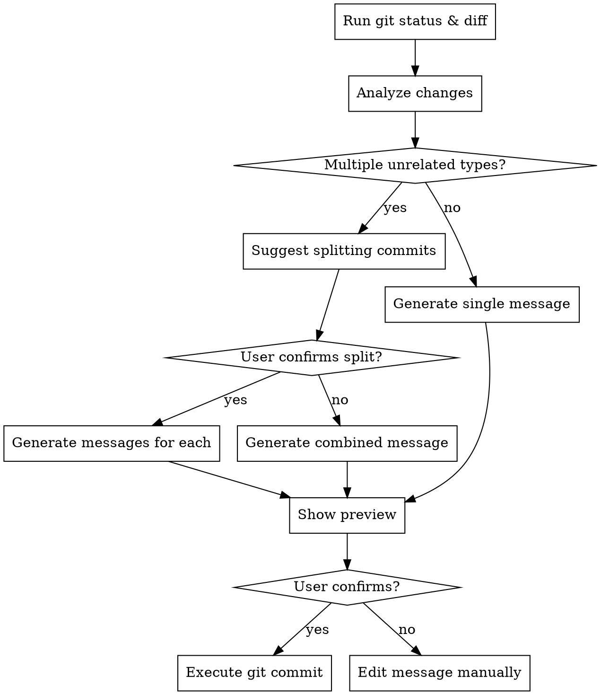

# Dev Commit

## Overview

Generate conventional commit messages from git diff, show preview, and commit after confirmation.

## When to Use

User runs `/dev-commit` or asks to commit changes with auto-generated message.

## Commit Types

| Type | Usage |
|------|-------|
| `[feat]` | New feature |
| `[fix]` | Bug fix |
| `[docs]` | Documentation only |
| `[refactor]` | Code change without behavior change |
| `[test]` | Adding/updating tests |
| `[chore]` | Build, deps, tooling |
| `[style]` | Formatting, whitespace |
| `[perf]` | Performance improvement |

## Workflow



## Message Format

```
[<type>]: <description>
```

**Rules:**
- Type in square brackets: `[feat]`, `[fix]`, etc.
- Description: lowercase, no period, imperative mood ("add" not "added")
- Keep under 72 characters

## Examples

| Change | Message |
|--------|---------|
| Add login button | `[feat]: add login button to navbar` |
| Fix null pointer | `[fix]: handle null response from user service` |
| Update README | `[docs]: add installation instructions` |
| Rename variable | `[refactor]: rename userId to accountId for clarity` |
| Add unit test | `[test]: add tests for password validation` |

## Pre-flight Checks (MUST do first)

Before anything else, verify these conditions. If ANY check fails, show friendly error and STOP:

```bash
# 1. Check if in git repository
git rev-parse --is-inside-work-tree
```
❌ **If fails:** "⚠️ ไม่พบ git repository ใน directory นี้ กรุณา cd ไปยัง project folder ก่อน"

```bash
# 2. Check if git is installed
git --version
```
❌ **If fails:** "⚠️ ไม่พบ git กรุณาติดตั้ง git ก่อน"

```bash
# 3. Check for any changes (staged or unstaged)
git status --porcelain
```
❌ **If empty output:** "✅ ไม่มีการเปลี่ยนแปลงที่จะ commit ครับ"

```bash
# 4. Check if there are staged changes
git diff --cached --quiet
```
- **If exit code 0 (no staged changes):** Check unstaged and ask user:
  ```
  📁 ไม่มี staged changes แต่พบ unstaged changes:
  [list files]

  ต้องการ stage ทั้งหมดไหม? [y/n/select]
  ```

```bash
# 5. Check for merge conflicts
git diff --check
```
❌ **If has conflicts:** "⚠️ มี merge conflicts กรุณาแก้ไขก่อน commit"

```bash
# 6. Check if user.name and user.email are configured
git config user.name && git config user.email
```
❌ **If not set:** "⚠️ ยังไม่ได้ตั้งค่า git user กรุณารัน:
  git config --global user.name \"Your Name\"
  git config --global user.email \"your@email.com\""

## Process

Only proceed if ALL pre-flight checks pass:

1. **Analyze staged changes:**
   ```bash
   git diff --cached --stat
   git diff --cached
   ```

2. **If no staged changes, handle unstaged:**
   - List unstaged files
   - Ask: stage all / select files / cancel
   - Stage selected files with `git add`

3. **Identify change type(s)** from the diff analysis.

4. **Generate message** following `[type]: description` format.

5. **Show preview:**
   ```
   📝 Commit Message Preview:
   ───────────────────────────
   [feat]: add login button to navbar

   Files: 3 changed, 45 insertions, 12 deletions
   ───────────────────────────
   Commit this? [y/n/e=edit]
   ```

6. **Execute on confirmation:**
   ```bash
   git commit -m "[feat]: add login button to navbar"
   ```

7. **Post-commit check:**
   ```bash
   git log -1 --oneline
   ```
   Show: "✅ Committed: [hash] [message]"

## Multiple Change Types

If diff contains unrelated changes (e.g., bug fix + new feature):

```
⚠️ Detected multiple change types:
  - [fix]: password validation in auth.service.ts
  - [feat]: new user profile endpoint

Recommendation: Split into 2 commits for cleaner history.
Split commits? [y/n]
```

## Red Flags

- Don't commit without showing preview first
- Always use `[type]:` format with square brackets
- Don't use past tense ("added") - use imperative ("add")
- Don't combine truly unrelated changes without asking
- NEVER skip pre-flight checks

## Error Handling Summary

| Situation | Action |
|-----------|--------|
| Not a git repo | Show error, suggest cd to project |
| Git not installed | Show error, suggest install |
| No changes at all | Show "nothing to commit" |
| No staged changes | Ask to stage unstaged files |
| Merge conflicts | Show error, suggest resolve first |
| Git user not configured | Show error, provide config commands |
| Commit fails | Show git error message, don't retry automatically |
| User cancels | Abort gracefully, no error |
