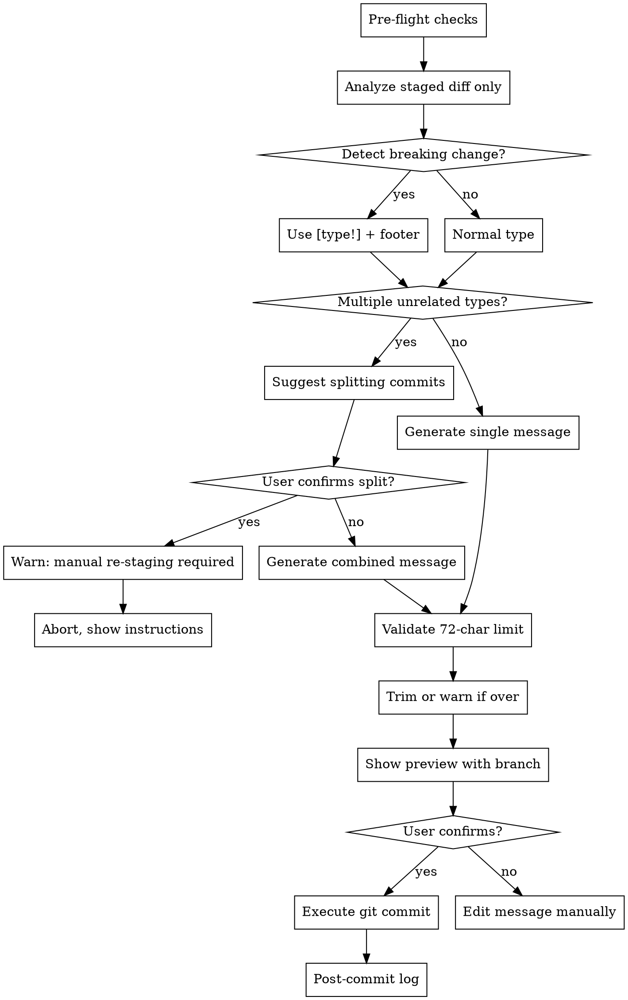

# Dev Commit

## Overview

Generate conventional commit messages from **staged changes only (`git diff --cached`)**, show preview, and commit after confirmation. Never touch unstaged files.

## When to Use

User runs `/dev-commit` or asks to commit changes with auto-generated message.

## Commit Types

| Type | Usage |
|------|-------|
| `[feat]` | New feature |
| `[fix]` | Bug fix |
| `[docs]` | Documentation only |
| `[refactor]` | Code change without behavior change |
| `[test]` | Adding/updating tests |
| `[chore]` | Build, deps, tooling |
| `[style]` | Formatting, whitespace |
| `[perf]` | Performance improvement |
| `[feat!]` | Breaking change — new feature |
| `[fix!]` | Breaking change — bug fix |

## Workflow



## Message Format

```
[<type>]: <description>
```

**For breaking changes:**
```
[<type>!]: <description>

BREAKING CHANGE: <what changed and why it breaks>
```

**Rules:**
- Type in square brackets: `[feat]`, `[fix]`, etc.
- Description: lowercase, no period, imperative mood ("add" not "added")
- Must be **≤ 72 characters** total (including `[type]: `)
- If over 72 chars — trim description, never truncate mid-word

## Examples

| Change | Message |
|--------|---------|
| Add login button | `[feat]: add login button to navbar` |
| Fix null pointer | `[fix]: handle null response from user service` |
| Update README | `[docs]: add installation instructions` |
| Rename variable | `[refactor]: rename userId to accountId for clarity` |
| Add unit test | `[test]: add tests for password validation` |
| Remove public API | `[feat!]: replace getUserById with getUserByUUID` |

## Pre-flight Checks (MUST do first, in order)

Before anything else, verify these conditions. If ANY check fails, show friendly error and STOP:

```bash
# 1. Check if git is installed
git --version
```
❌ **If fails:** "⚠️ ไม่พบ git กรุณาติดตั้ง git ก่อน"

```bash
# 2. Check if in git repository
git rev-parse --is-inside-work-tree
```
❌ **If fails:** "⚠️ ไม่พบ git repository ใน directory นี้ กรุณา cd ไปยัง project folder ก่อน"

```bash
# 3. Check for merge/cherry-pick in progress
git rev-parse --git-dir
# Then check for special state files: MERGE_HEAD, CHERRY_PICK_HEAD, REBASE_HEAD
```
❌ **If any exist:** "⚠️ พบ [merge/cherry-pick/rebase] ที่ยังค้างอยู่ กรุณาทำให้เสร็จหรือ abort ก่อน commit"

```bash
# 4. Check for unresolved merge conflicts in staged files
git diff --name-only --diff-filter=U
```
❌ **If output not empty:** "⚠️ มี merge conflicts ในไฟล์: [list] กรุณาแก้ไขก่อน commit"

```bash
# 5. Check for staged changes (ONLY staged — never auto-stage anything)
git diff --cached --quiet
```
❌ **If exit code 0 (nothing staged):** 
```
⚠️ ไม่มี staged changes
กรุณารัน: git add <files> ก่อน แล้วค่อยรัน /dev-commit อีกครั้ง
```
> **Policy:** This tool commits **only what you have explicitly staged**. It will never run `git add` on your behalf.

```bash
# 6. Check git user config
git config user.name && git config user.email
```
❌ **If not set:** "⚠️ ยังไม่ได้ตั้งค่า git user กรุณารัน:
  git config --global user.name \"Your Name\"
  git config --global user.email \"your@email.com\""

## Process

Only proceed if ALL pre-flight checks pass:

1. **Analyze staged changes only:**
   ```bash
   git diff --cached --stat
   git diff --cached
   ```

2. **Detect breaking changes** — look for:
   - Removed or renamed exported functions/classes/types
   - Changed function signatures (parameters added/removed/reordered)
   - Deleted public API endpoints
   - Changed environment variable names
   - If found → use `[type!]` and add `BREAKING CHANGE:` footer

3. **Identify change type(s)** from diff analysis.

4. **Validate message length** — must be ≤ 72 characters. Trim if needed, warn user.

5. **Get current branch:**
   ```bash
   git branch --show-current
   ```

6. **Show preview:**
   ```
   📝 Commit Message Preview:
   ───────────────────────────
   Branch : main
   Message: [feat]: add login button to navbar

   Files  : 3 changed, 45 insertions(+), 12 deletions(-)
   ───────────────────────────
   ⚠️  Unstaged changes exist but will NOT be included (by design)
   Commit staged changes? [y/n/e=edit]
   ```
   > Always show the unstaged warning if `git status --porcelain` has unstaged files — reminds user nothing extra was touched.

7. **Execute on confirmation:**
   ```bash
   git commit -m "[feat]: add login button to navbar"
   # For breaking changes:
   git commit -m "[feat!]: replace getUserById with getUserByUUID" -m "BREAKING CHANGE: getUserById removed, use getUserByUUID with string UUID parameter"
   ```

8. **Post-commit check:**
   ```bash
   git log -1 --oneline
   ```
   Show: "✅ Committed: [hash] [message]"

## Multiple Change Types

If staged diff contains unrelated changes (e.g., bug fix + new feature):

```
⚠️ Detected multiple change types in staged files:
  - [fix]: password validation in auth.service.ts
  - [feat]: new user profile endpoint

Recommendation: Split into 2 commits for cleaner history.
Split commits? [y/n]
```

**If user says yes:**
```
⚠️ Auto-split is not possible — splitting requires manual re-staging.

To split:
  1. git restore --staged <files-for-second-commit>
  2. Run /dev-commit  (commits remaining staged files)
  3. git add <files-for-second-commit>
  4. Run /dev-commit  (commits the rest)

Aborting. No commit was made.
```

**If user says no:** generate combined message and continue.

## Red Flags

- **NEVER run `git add` automatically** — user controls what gets staged
- Always show preview before committing
- Always use `[type]:` format with square brackets
- Don't use past tense ("added") — use imperative ("add")
- Don't combine truly unrelated changes without asking
- NEVER skip pre-flight checks
- NEVER commit if special state files exist (MERGE_HEAD, etc.)

## Error Handling Summary

| Situation | Action |
|-----------|--------|
| Git not installed | Show error, suggest install |
| Not a git repo | Show error, suggest cd to project |
| Merge/cherry-pick in progress | Show error, suggest finish or abort |
| Unresolved conflicts in staged files | Show conflicted file list, suggest resolve |
| Nothing staged | Show error, remind user to `git add` manually |
| Git user not configured | Show error, provide config commands |
| Message over 72 chars | Trim + warn in preview |
| Breaking change detected | Use `[type!]` + `BREAKING CHANGE:` footer |
| User wants to split commits | Explain manual re-staging steps, abort |
| Commit fails | Show git error message, don't retry automatically |
| User cancels | Abort gracefully, no error |
